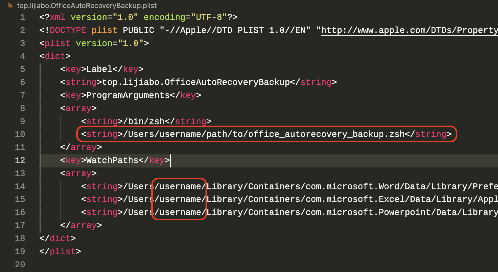

# BetterOfficeAutoRecovery

## 系统要求 System Requirements
适用macOS版本：macOS Ventura 13.0.1（只在这个版本测试过）
适用Office版本：Microsoft Word/Excel/PowerPoint（Microsoft 365），Mac App Store版

---
macOS version: macOS Ventura 13.0.1 (only tested on this version)
Office version: Microsoft Word/Excel/PowerPoint (Microsoft 365)，Mac App Store version

## 介绍 Introduction
 Mac上的Office的自动恢复功能可以在断电/意外关闭等情况恢复文件，但如果退出软件时手滑点了“不存储”，自动恢复文件会被删除，本脚本使用launchd，在自动恢复目录发生变化时自动调用脚本，将Word、Excel、PowerPoint的自动恢复目录压缩为.tar.gz文件，并保存到指定目录中，需要时恢复即可。

---
 Office on macOS has a auto recovery feature which can recovery your files unsaved, but if you click "Don't Save" when you exit the software, auto recovery files will be deleted. Load the plist file to launchd and when the auto recovery directories change, they will be automatically archived to a custom folder.

 ## 用法 Usage
 1. 下载本仓库
 2. 将plist文件中红框位置处**更改为实际的路径**
    
 3. 打开终端，输入：
```zsh
launchctl load plist文件的路径
```
---
1. Clone this repository
2. **CHANGE THE PATH in red rectangle below to actual path**
3. Open the terminal and run:
```zsh
launchctl load /path/to/plist
```